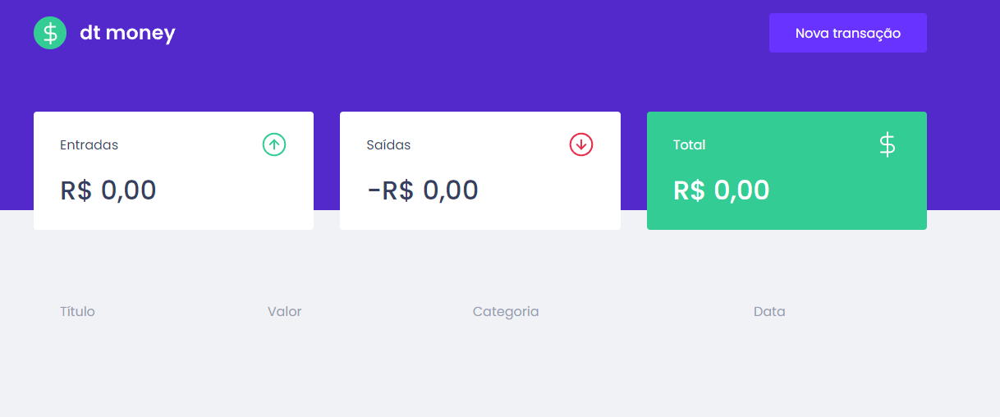

<h1 align="center"> DT Money </h1>

Trilha Ignite 2021 Chapter 2

  <a href="#-tecnologias">Tecnologias</a>&nbsp;&nbsp;&nbsp;|&nbsp;&nbsp;&nbsp;
  <a href="#-projeto">Projeto</a>&nbsp;&nbsp;&nbsp;|&nbsp;&nbsp;&nbsp;
  <a href="#-layout">Layout</a>&nbsp;&nbsp;&nbsp;|&nbsp;&nbsp;&nbsp;
  <a href="#memo-licença">Licença</a>

  

 

  

## 🚀 Tecnologias

Esse projeto foi desenvolvido com as seguintes tecnologias:

- HTML
- ReactJS
- Styled-Components
- Typescript
- Axios
- MigrateJS

## 💻 Projeto

Um sistema de controle financeiro feito com ReactJS, é possivel adicionar e removar transações

## :memo: Licença

Esse projeto está sob a licença MIT.

---
